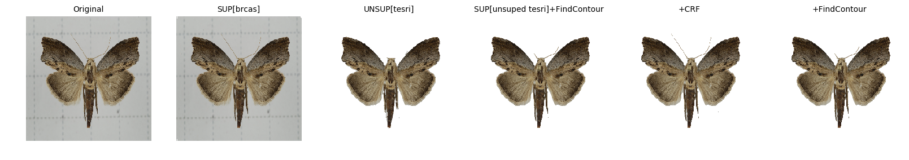
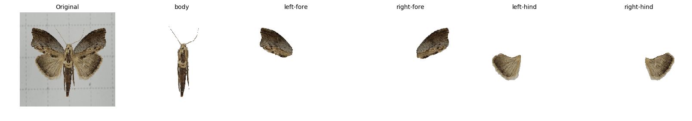
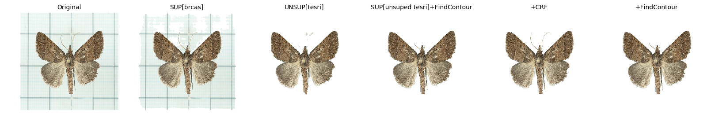
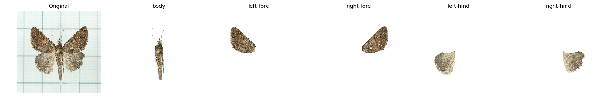

# Colorful Moth
[](LICENSE)


---
## Moth Segmentation
This part contains the details of background-removal and 5-body-part segmentation processes of moth specimen images from TESRI(Taiwan Endemic Species Research Institute).

 - [Source data](data/brcas/): BRCAS with labels.
 - [Target data](data/tesri/): TESRI without labels.

### Usage
```
# pipenv

$ cd /to/working/directory/
$ pipenv sync
$ pipenv shell
  

# get model

$ bash get_models.sh


# train a new model

 - for unsupvised way
$ python3 Unsup_train.py --XX_DIR=/path/to/image --SAVEDIR=/path/to/save/ --minLabels=/minimum/number/of/labels/ --gpu='gpu_id'

 - for supervised way
$ python3 Sup_train.py --XX_DIR=/path/to/image/ --YY_DIR=/path/to/groundtruth/ --SAVEDIR=/path/to/save/ --num_class= number of output class --gpu='gpu_id'


# prediction

 - for background removal
$ python3 Sup_predict_rmbg.py --XX_DIR=/path/to/image --model_dir=/path/to/checkpoint/ --gpu='gpu_id'

 - for 5-body-part segmentation
$ python3 Sup_predict_5comps.py --XX_DIR=/path/to/image --model_dir=/path/to/checkpoint/ --gpu='gpu_id'
```
 - [Postprocess.ipynb](Postprocess.ipynb) postprocesses background-removal model results(find_contour and condition random field).
 - [5comps_output_process.ipynb](5comps_output_process.ipynb) processes 5-comps model results to generate final images.
 - [Visualize.ipynb](Visualize.ipynb) visulizes some samples of different background-removal steps and 5-comps results.


### Result Sample
Here we show some sample results of the complete processes, you could find more samples in [result_sample](result_sample/) 
The first row of each species are what we've tried to remove background. Then we chose the best one for each moth to segment its 5-body parts.
The second row are the 5-body-part result of that moth.





### Acknowledgements 
This repository reuses code from [pytorch-unsupervised-segmentation](https://github.com/kanezaki/pytorch-unsupervised-segmentation) by kanezaki and [Data_Science_Bowl_2018](https://github.com/RaoulMa/Data_Science_Bowl_2018) by RaoulMa. Many thanks to all the contributions!

---
